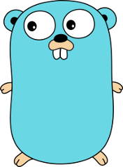
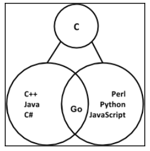

# Sobre Go


> Imagen - [\[38\]](../recursos.md)

"Go es un lenguaje de programación de código abierto que facilita la creación de software simple, confiable y eficiente". [\[1\]](../recursos.md)

"Go es expresivo, conciso, limpio y eficiente. Sus mecanismos de concurrencia facilitan la escritura de programas que aprovechan al máximo las máquinas multinúcleo, y de red, mientras que su novedoso sistema de tipo permite la construcción de programas flexibles y modulares. Go compila rápidamente el código de máquina y tiene la comodidad de la recolección de basura y el poder de la reflexión en tiempo de ejecución. Es un lenguaje compilado, rápido, de tipado estático, que se siente como un lenguaje interpretado de tipado dinámico". [\[2\]](../recursos.md)

## Orígenes

_Go_ fue creado en Google en el año 2007 por _Robert Griesemer_, _Rob Pike_, y _Ken Thomson_.



> Imagen - [\[39\]](../recursos.md)

Su lanzamiento oficial fue en noviembre del año 2009, pero su primera versión estable - 1.0 - recién se publicó en marzo de 2012.

Originalmente fue concebido para resolver problemas propios de la infraestructura de software de Google. Según palabras de unos de sus creadores _Rob Pike_, "Los objetivos del proyecto _Go_ fueron eliminar la lentitud y la torpeza del desarrollo de software en Google y, por lo tanto, hacer que el proceso sea más productivo y escalable. El lenguaje fue diseñado por y para las personas que escriben, leen, depuran y mantienen sistemas de software grandes. Por lo tanto, el propósito de _Go_ no fue investigar el diseño de un lenguaje de programación; sino mejorar el entorno de trabajo para sus diseñadores y sus compañeros de trabajo. _Go_ tiene más que ver con la ingeniería del software que con la investigación en un lenguaje de programación" [\[53\]](../recursos.md).

Entre los principales problemas de Google que motivaron el desarrollo de _Go_ se pueden destacan:

* los largos tiempos de compilación
* las dependencias no controladas
* las variaciones de uso de subconjuntos diferentes de un lenguaje por parte de los desarrolladores
* los códigos difíciles de leer
* los códigos mal documentados

### Sobre su nombre

Dado que la palabra _Go_ es parte del idioma ingles el lenguaje también es conocido como _Golang_.

> Se recomienda utilizar el término _Golang_ al realizar búsquedas en internet referidas al lenguaje.

## Características

_Go_ está inspirado en la sintaxis de _C_ como otros lenguajes: _C++_, _C\#_, _Java_, _PHP_, _Javascript_, etc.

Su elección fue ser afín a la gran comunidad de desarrolladores de _C++_ de Google.

Por sus características suele clasificarse como un lenguaje compilado que tiene características de lenguajes interpretados.



> Imagen - [\[16\]](../recursos.md)

Para _Rob Pike_: "_Go_ es un intento de combinar la seguridad y el rendimiento de un lenguaje de tipado estático con la expresividad y la comodidad de un lenguaje interpretado de tipo dinámico." [\[16\]](../recursos.md)

_Go_ se caracteriza por ser un lenguaje:

* compilado,
* concurrente,
* de tipado estático,
* con recolector de basura,
* con uso de punteros - _pero sin aritmética_
* con cortos tiempos de compilación

Se destaca también por su diseño minimalista y su facilidad para aprenderlo. A modo de comparación mientras otros lenguajes tienen muchas palabras reservadas, _C++ 20_ tiene 96, _C\# 7_ tiene 78, _Java 13_ tiene 51; _Go_ sólo tiene 25.

### Ejemplo

```go
package main

import "fmt"

func main() {
    fmt.Println("www.designpatternsingo.com")
}
```

[Ejecutar código](https://play.golang.org/p/vhgR-fZxZv6)

### Según otros autores

Para Mark Summerfield [\[27\]](../recursos.md) "_Go_ es bastante parecido a _C_ en su espíritu, ya que es un lenguaje pequeño y eficiente con convenientes facilidades de bajo nivel, como punteros. Sin embargo, _Go_ también ofrece muchas características asociadas con lenguajes de alto o muy alto nivel, como cadenas Unicode, potentes estructuras de datos integradas, duck typing, recolección de basura y soporte de concurrencia de alto nivel que utiliza comunicaciones en lugar de datos compartidos y bloqueos. _Go_ también tiene una gran biblioteca estándar de amplio rango".

Para Shiju Varghese [\[19\]](../recursos.md) "El lenguaje de programación _Go_ se puede describir simplemente en tres palabras: simple, mínimo y pragmático. El objetivo del diseño de _Go_ es ser un lenguaje de programación simple, minimalista y expresivo que proporcione todas las características esenciales para crear sistemas de software confiables y eficientes. Cada idioma tiene su propio objetivo de diseño y una filosofía única. La simplicidad no se puede agregar más adelante en el idioma, por lo que debe ser construida con la simplicidad en mente. _Go_ está diseñado para ser simple. Al combinar la simplicidad y el pragmatismo de _Go_, puede construir sistemas de software altamente eficientes con un mayor nivel de productividad".

Para Karl Seguin [\[11\]](../recursos.md) "_Go_ tiene la naturaleza de simplificar la complejidad que hemos visto incluida en los lenguajes de programación en el último par de décadas mediante el uso de varios mecanismos".

Para Caleb Doxsey [\[52\]](../recursos.md) "_Go_ es un lenguaje de programación de propósito general con características avanzadas y una sintaxis limpia. Debido a su amplia disponibilidad en una variedad de plataformas, su robusta biblioteca standard bien documentada y su enfoque en buenos principios de la ingeniería del software, _Go_ es un gran lenguaje de programación para aprender".

## Controversias

_Go_ como todos los lenguajes de programación presenta ciertas controversias. Sus detractores por ejemplo manifiestan que el lenguaje carece de:

* genéricos
* manejo de excepciones
* sobrecarga de operadores

> En el siguiente link puede acceder a una serie de artículos, de diferentes autores, destinados a detallar y debatir sobre las debilidades que encuentran en el lenguaje _Go_ - [https://github.com/ksimka/go-is-not-good](https://github.com/ksimka/go-is-not-good) [\[51\]](../recursos.md). Varios de los argumentos son bastantes graciosos desde mi punto de vista: por ejemplo algunos critican la mascota del lenguaje, o se quejan de que es un lenguaje compilado, o que su sintaxis es del estilo de _C_.

No obstante el equipo de diseño de _Go_ no es ajeno a estas críticas, y permite que se propongan nuevas funcionalidades. Para esto se deben completar una serie de pasos que se encuentran documentados en el siguiente link: [https://github.com/golang/proposal](https://github.com/golang/proposal).

_Go_ trata de respetar su filosofía de mantener un lenguaje extremadamente simple y rápido de compilar, por lo que la incorporación de nuevas características que pudieran afectar a uno de estos dos puntos debe poder justificarse claramente, y no debe existir forma alguna de poder llevar a cabo esa tarea con las características actuales del lenguaje. Por ejemplo estas son algunas respuestas que la documentación de _Go_ da sobre la no existencia de excepciones:

"En _Go_, el manejo de errores es importante. El diseño y las convenciones del idioma lo alientan a verificar explícitamente si ocurren errores \(a diferencia de la convención en otros idiomas de arrojar excepciones y, a veces, capturarlas\). En algunos casos, esto hace que código de _Go_ sea verboso, pero afortunadamente hay algunas técnicas que puede utilizar para minimizar el manejo de errores repetitivos." [\[50\]](../recursos.md)

"Creemos que acoplar excepciones a una estructura de control como en el try-catch-finally, da como resultado un código intrincado. También tiende a alentar a los programadores a etiquetar demasiados errores comunes, como no abrir un archivo, como excepcionales. _Go_ toma un enfoque diferente. Para el manejo simple de errores, los retornos multi-valor de _Go_ facilitan el reporte de un error sin sobrecargar el valor de retorno. Un tipo de error canónico, junto con otras características de _Go_, hace que el manejo de errores sea agradable, pero bastante diferente del de otros lenguajes." [\[44\]](../recursos.md)

Esta filosofía para algunos controvertida es la que creo en mi opinión que hace a _Go_ tan interesante. En vez incorporar constantemente nuevas características y/o copiar otras de otros lenguajes de programación, _Go_ intenta mantener un lenguaje simple, mínimo y conciso.

### Proverbios de Go

Los proverbios de _Go_ invitan a los desarrolladores a reflexionar sobre la filosofía de _Go_ y a la enseñanza sobre el lenguaje.

Se invita a los lectores a profundizar más sobre esta filosofía en base a la charla de Rob Pike en el Gopherfest del año 2015: "Go Proverbs". [\[33\]](../recursos.md)

A continuación se exponen sólo algunos de estos proverbios:

* No se comunique compartiendo memoria, comparta memoria comunicándose.
* La concurrencia no es paralelismo.
* Cuanto más grande es la interfaz, más débil es la abstracción.
* Haz que el valor cero sea útil.
* _interface{}_ no dice nada.
* El estilo de _gofmt_ no es el favorito de nadie, sin embargo, _gofmt_ es el favorito de todos.
* Copiar un poco es mejor que una pequeña dependencia.
* Claro es mejor que inteligente.
* La reflexión nunca es clara.
* Los errores son valores
* No solo revise los errores, trátelos con gracia.

Puede acceder al listado completo y actualizado en [https://go-proverbs.github.io](https://go-proverbs.github.io/).

