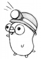

# Patrones de Diseño

> Imagen - [\[38\]](../../recursos.md)

Este apartado tratará sobre _**¿Qué es un Patron de Diseño?**_ y _**¿Qué es GoF?**_.

## Patrones de Diseño

En el libro de Erich Gamma et al - "Patrones de Diseño" [\[29\]](../../recursos.md) - exponen la importancia y usos de los patrones de diseño en conceptos como:

* "Diseñar software orientado a objetos es difícil, y aún lo es más diseñar software orientado a objetos reutilizable".
* "Algo que los expertos saben que no hay que hacer es resolver cada problema partiendo de cero. Por el contrario, reutilizan soluciones que ya les han sido útiles en el pasado. Cuando encuentran una solución buena, la usan una y otra vez".
* "Los patrones de diseño hacen que sea más fácil reutilizar buenos diseños y arquitecturas".
* "Los patrones de diseño nos ayudan a elegir las alternativas de diseño que hacen que un sistema sea reutilizable, y a evitar aquéllas que dificultan dicha reutilización. Pueden incluso mejorar la documentación y el mantenimiento de los sistemas existentes al proporcionar una especificación explícita de las interacciones entre clases y objetos y de cúal es su intención. En definitiva los patrones de diseño ayudan a un diseñador a lograr un buen diseño más rápidamente".

Como se puede observar se utilizan términos como _clases_ y _objetos_ ya que los patrones de diseño están enfocados al desarrollo orientado a objetos siendo los ejemplos de su libro implementados en _C++_.

En las siguientes secciones se detallará como es posible implementar dichos patrones de diseño en _Go_.

## Contenido

* [Patrones de Diseño GoF](gof.md)
* [Patrones de Comportamiento](comportamiento/)
* [Patrones Creacionales](creacionales/)
* [Patrones Estructurales](estructurales/)

