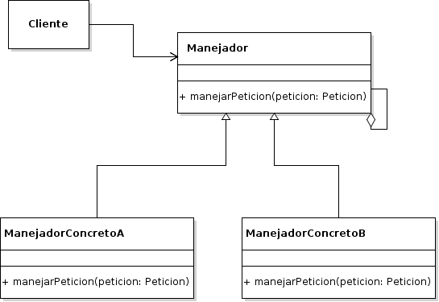

# Chain of Responsibility

## Propósito

Según el libro "Patrones de Diseño" [\[29\]](../../../recursos.md) el patrón _Chain of Responsibility_ "evita acoplar el emisor de una petición a su receptor, dando a más de un objeto la posibilidad de responder a la petición. Encadena los objetos receptores y pasa la petición a través de la cadena hasta que es procesada por algún objeto".

## Estructura



## Participantes

* **Manejador:**
  * define una interfaz para tratar las peticiones.
  * _\(opcional\)_ implementa el enlace al sucesor.
* **ManejadorConcreto:**
  * trata las peticiones de las que es responsable.
  * puede acceder a su sucesor.
  * si el ManejadorConcreto puede manejar la petición, lo hace; en caso contrario la reenvía a su sucesor.
* **Cliente:**
  * inicializa la petición a una variable ManejadorConcreto de la cadena.

## Implementación

* No se observan impedimentos para su implementación en _Go_.
* La implementación de la clase abstracta _Manejador_ debe reemplazarse por una interface dado que no existe la herencia de clase en _Go_.
* Si fuese necesario que _Manejador_ implementase código común a los _ManejadoresConcretos_ se podrá definir un tipo de dato adicional \(_ManejadorComun_ por ejemplo\) y el mismo deberá implementarse en cada _ManejadorConcreto_ mediante el uso de la composición.

## Código de ejemplo

En este ejemplo se definen dos receptores distintos de mensajes. Uno para mensajes de alta prioridad y otro para mensajes de baja prioridad. El mensaje enviado por el cliente es transmitido a través de la cadena de receptores y cada receptor trata o no el mensaje de acuerdo a su prioridad.

Implementación:

```go
// Interface
type Receptor interface {
    ProcesarMensaje(int, string) string
}

// Receptor de Alta Prioridad
type ReceptorAltaPrioridad struct{
    siguiente Receptor
}

func (rap ReceptorAltaPrioridad) ProcesarMensaje(prioridad int, mensaje string) string {
    if prioridad >= 5 {
       return "Procesando mensaje de alta prioridad: " + mensaje
    }

    if rap.siguiente != nil {
       return rap.siguiente.ProcesarMensaje(prioridad, mensaje)
    }

    return ""
}

// Receptor de Baja Prioridad
type ReceptorBajaPrioridad struct{
    siguiente Receptor
}

func (rbp ReceptorBajaPrioridad) ProcesarMensaje(prioridad int, mensaje string) string {
    if prioridad < 5 {
       return "Procesando mensaje de baja prioridad: " + mensaje
    }

    if rbp.siguiente != nil {
       return rbp.siguiente.ProcesarMensaje(prioridad, mensaje)
    }

    return ""
}
```

Se puede probar la implementación del patrón de la siguiente forma:

```go
manejadores := ReceptorBajaPrioridad {
    siguiente: ReceptorAltaPrioridad {},
}

fmt.Println(manejadores.ProcesarMensaje(4, "Mensaje 1 - Prioridad 4"))
fmt.Println(manejadores.ProcesarMensaje(5, "Mensaje 2 - Prioridad 5"))
fmt.Println(manejadores.ProcesarMensaje(10, "Mensaje 3 - Prioridad 10"))
```

[Código de ejemplo](https://github.com/danielspk/designpatternsingo/tree/master/patrones/comportamiento/chainofresponsability) \| [Ejecutar código](https://play.golang.org/p/TnwdRltyBds)

