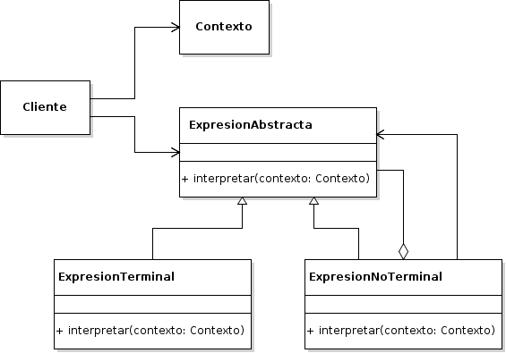

# Interpreter

## Propósito

Según el libro "Patrones de Diseño" [\[29\]](../../../recursos.md) el patrón _Interpreter_ "dado un lenguaje, define una representación de su gramática junto con un intérprete que usa dicha representación para interpretar sentencias del lenguaje".

## Estructura



## Participantes

* **ExpresionAbstracta:**
  * declara una operación abstracta _interpretar_ que es común a todos los nodos del árbol de sintaxis abstracto.
* **ExpresionTerminal:**
  * implementa una operación _interpretar_ asociada con los símbolos terminales de la gramática.
  * se necesita una variable de este tipo de dato para cada símbolo terminal de la sentencia.
* **ExpresionNoTerminal:**
  * por cada regla de la gramática debe haber uno de estos tipos de datos.
  * mantiene variables de tipo ExpresionAbstracta para cada uno de los símbolos de cada regla.
* **Contexto:**
  * contiene información que es global al intérprete.
* **Cliente:**
  * construye \(o recibe\) un árbol sintáctico abstracto que representa una determinada sentencia del lenguaje definido por la gramática. Este árbol sintáctico abstracto está formado por variables del tipo de dato ExpresionNoTerminal y ExpresionTerminal.
  * invoca a la operación _interpretar_.

## Implementación

* No se observan impedimentos y/o modificaciones de la estructura original del patrón para su implementación en _Go_.
* La _ExpresionAbstracta_ se define como una interfaz por simplificación.

## Código de ejemplo

En este ejemplo queremos interpretar distintas expresiones lógicas: AND y OR en base a palabras definidas en un contexto.

Implementación:

```go
// Contexto
type Contexto struct {
    Palabra string
}

// Interface
type ExpresionAbstracta interface {
    Interpretar(Contexto) bool
}

// Expresion Terminal
type ExpresionTerminal struct {
    Palabra string
}

func (et *ExpresionTerminal) Interpretar(contexto Contexto) bool {
    return contexto.Palabra == et.Palabra
}

// Expresion No Terminal
type ExpresionOR struct {
    expresionA ExpresionAbstracta
    expresionB ExpresionAbstracta
}

func (eo *ExpresionOR) Interpretar(contexto Contexto) bool {
    return eo.expresionA.Interpretar(contexto) || eo.expresionB.Interpretar(contexto)
}

// Expresion No Terminal
type ExpresionAND struct {
    expresionA ExpresionAbstracta
    expresionB ExpresionAbstracta
}

func (ea *ExpresionAND) Interpretar(contexto Contexto) bool {
    return ea.expresionA.Interpretar(contexto) && ea.expresionB.Interpretar(contexto)
}
```

Se puede probar la implementación del patrón de la siguiente forma:

```go
expresionA := &ExpresionTerminal{"Perro"}
expresionB := &ExpresionTerminal{"Gato"}
expresionC := &ExpresionTerminal{"Perro"}

contextoOR := Contexto{"Perro"}
expresionOR := &ExpresionOR{expresionA, expresionB}
fmt.Printf("La expresion OR contiene la palabra perro: %v\n", expresionOR.Interpretar(contextoOR))

contextoAND := Contexto{"Perro"}
expresionAND := &ExpresionAND{expresionA, expresionC}
fmt.Printf("La expresion AND contiene dos palabras perro: %v\n", expresionAND.Interpretar(contextoAND))
```

[Código de ejemplo](https://github.com/danielspk/designpatternsingo/tree/master/patrones/comportamiento/interpreter) \| [Ejecutar código](https://play.golang.org/p/zmXhDClx5k7)


> **Atención**: Esta publicación se encuentra abandonada. Puede acceder a la versión vigente en [https://leanpub.com/designpatternsingo](https://leanpub.com/designpatternsingo)

