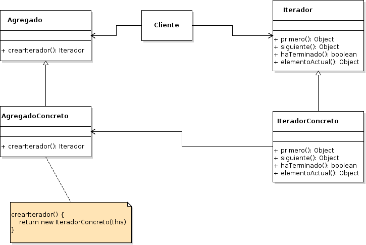

# Iterator

## Propósito

Proporciona un modo de acceder secuencialmente a los elementos de una variable agregada sin exponer su representación interna.

## También conocido como

_Cursor_

## Estructura



## Participantes

* **Iterador:**
  * define una interfaz para recorrer los elementos y acceder a ellos.
* **IteradorConcreto:**
  * implementa la interfaz Iterador.
  * mantiene la posición actual en el recorrido del agregado.
* **Agregado:**
  * define una interfaz para crear una variable Iterador.
* **AgregadoConcreto:**
  * implementa la interfaz de creación de Iterador para devolver una variable del IteradorConcreto apropiado.

## Implementación

* No se observan impedimentos y/o modificaciones de la estructura original del patrón para su implementación en _Go_.
* El _Iterador_ y _Agregado_ se definen como interfaces por simplificación.

## Código de ejemplo

En este ejemplo queremos recorrer las distintas estaciones de radio preseteadas de un estéreo de audio.

Implementación:

```go
// Iterador Interface
type Iterador interface {
    Valor() string
    Siguiente()
    Anterior()
}

// Agregado Interface
type Agregado interface {
    CrearIterador() Iterador
}

// Agregado Concreto
type Radio struct {
    Estaciones []string
}

func (r *Radio) CrearIterador() Iterador {
    return &RadioIterador{radio: r}
}

func (r *Radio) Registrar(estacion string) {
    r.Estaciones = append(r.Estaciones, estacion)
}

// Iterador Concreto
type RadioIterador struct {
    radio  *Radio
    indice int
}

func (ri *RadioIterador) Valor() string {
    return ri.radio.Estaciones[ri.indice]
}

func (ri *RadioIterador) Siguiente() {
    ri.indice++
}

func (ri *RadioIterador) Anterior() {
    ri.indice--
}
```

Se puede probar la implementación del patrón de la siguiente forma:

```go
radio := &Radio{}
radio.Registrar("FM100")
radio.Registrar("FM200")
radio.Registrar("FM300")

iterador := radio.CrearIterador()

fmt.Printf("Escuhando la radio %s\n", iterador.Valor())

iterador.Siguiente()
fmt.Printf("Escuhando la radio %s\n", iterador.Valor())

iterador.Siguiente()
fmt.Printf("Escuhando la radio %s\n", iterador.Valor())

iterador.Anterior()
fmt.Printf("Escuhando nuevamente la radio %s\n", iterador.Valor())
```

[Código de ejemplo](https://github.com/danielspk/designpatternsingo/tree/master/patrones/comportamiento/iterator) \| [Ejecutar código](https://play.golang.org/p/qpY_F7wrd6u)

