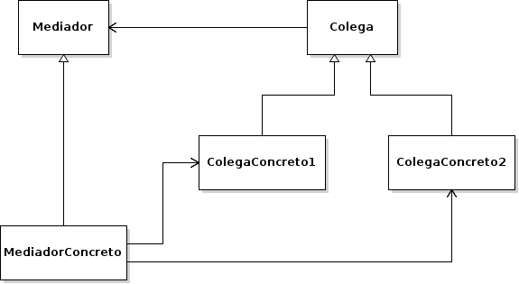

# Mediator

## Propósito

Según el libro "Patrones de Diseño" [\[29\]](../../../recursos.md) el patrón _Mediator_ "define un objeto que encapsula cómo interactúan una serie de objetos. Promueve un bajo acoplamiento al evitar que los objetos se refieran unos a otros explícitamente, y permite variar la interacción entre ellos de forma independiente".

## Estructura



## Participantes

* **Mediador:**
  * define una interfaz para comunicarse con sus variables Colega.
* **MediadorConcreto:**
  * implementa el comportamiento cooperativo coordinando variables Colega.
  * conoce a sus Colegas.
* **Colega:**
  * cada tipo de dato Colega conoce a su variable Mediador.
  * cada Colega se comunica con su mediador cada vez que, de no existir éste, se hubiera comunicado con otro Colega.

## Implementación

* No se observan impedimentos y/o modificaciones de la estructura original del patrón para su implementación en _Go_.
* El _Mediador_ y _Colega_ se definen como interfaces por simplificación.

## Código de ejemplo

En este ejemplo queremos montar una sala de chat en donde los usuarios puedan comunicarse entre sí. La sala de chat actúa como mediador entre los usuarios.

Implementación:

```go
// Interface Mediador
type Mediador interface {
    MostrarMensaje(Usuario, string)
}

// Mediador Concreto
type ChatRoom struct{}

func (cr *ChatRoom) MostrarMensaje(usuario Usuario, mensaje string) {
    fmt.Printf("El mensaje de %s es: %s\n", usuario.GetNombre(), mensaje)
}

// Interface Colega
type Usuario interface {
    EnviarMensaje(string)
    GetNombre() string
}

// Colega Concreto
type UsuarioChat struct {
    nombre   string
    mediador Mediador
}

func (u *UsuarioChat) GetNombre() string {
    return u.nombre
}

func (u *UsuarioChat) EnviarMensaje(mensaje string) {
    u.mediador.MostrarMensaje(u, mensaje)
}
```

Se puede probar la implementación del patrón de la siguiente forma:

```go
mediador := &ChatRoom{}

usuarioA := &UsuarioChat{"Daniel", mediador}
usuarioB := &UsuarioChat{"Pedro", mediador}

usuarioA.EnviarMensaje("Hola como estas?")
usuarioB.EnviarMensaje("Muy bien y vos?")
```

[Código de ejemplo](https://github.com/danielspk/designpatternsingo/tree/master/patrones/comportamiento/mediator) \| [Ejecutar código](https://play.golang.org/p/PWO1HBJYjPx)


> **Atención**: Esta publicación se encuentra abandonada. Puede acceder a la versión vigente en [https://leanpub.com/designpatternsingo](https://leanpub.com/designpatternsingo)

