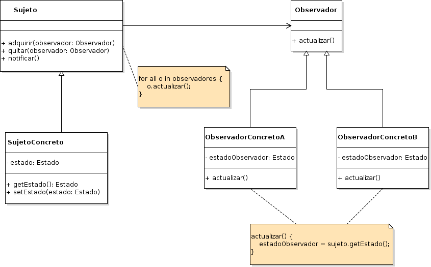

# Observer

## Propósito

Según el libro "Patrones de Diseño" [\[29\]](../../../recursos.md) el patrón _Observer_ "define una dependencia de uno-a-muchos entre variables, de forma que cuando una variable cambie de estado se notifique y se actualicen automáticamente todas las variables que dependan de ellá".

## También conocido como

_Dependents_ \(Dependientes\), _Publish-subscribe_ \(Publicar-Suscribir\)

## Estructura



## Participantes

* **Sujeto:**
  * conoce a sus observadores. Un sujeto puede ser observado por cualquier número de variables Observador.
  * proporciona una interfaz para asignar y quitar variables Observador.
* **Observador:**
  * define una interfaz para actualizar las variables que deben ser notificadas ante cambios en un sujeto.
* **SujetoConcreto:**
  * almacena el estado de interés para las variables ObservadorConcreto.
  * envía una notificación a sus observadores cuando cambia su estado.
* **ObservadorConcreto:**
  * mantiene una referencia a una variable SujetoConcreto.
  * guarda un estado que debería ser consistente con el del sujeto.
  * implementa la interfaz de actualización del Observador para mantener su estado consistente.

## Implementación

* No se observan impedimentos y/o modificaciones de la estructura original del patrón para su implementación en _Go_.
* El _Sujeto_ y _Observador_ se definen como interfaces por simplificación.

## Código de ejemplo

En este ejemplo queremos que postulantes a empleos sean notificados cuando se creen ofertas laborales.

Implementación:

```go
// Interface Sujeto
type Sujeto interface {
    Adquirir(Observador)
    notificar()
}

// Sujeto Concreto
type AgenciaEmpleo struct {
    observadores []Observador
}

func (ae *AgenciaEmpleo) Adquirir(observador Observador) {
    ae.observadores = append(ae.observadores, observador)
}

func (ae *AgenciaEmpleo) notificar(oferta string) {
    for _, observador := range ae.observadores {
        observador.Actualizar(oferta)
    }
}

func (ae *AgenciaEmpleo) IngresarOfertaLaboral(oferta string) {
    ae.notificar(oferta)
}

// Interface Observador
type Observador interface {
    Actualizar(string)
}

// Observador Concreto
type ObservadorEmpleo struct {
    nombre string
}

func (o *ObservadorEmpleo) Actualizar(oferta string) {
    fmt.Printf("Hola %s, existe la siguiente oferta de empleo: %s\n", o.nombre, oferta)
}
```

Se puede probar la implementación del patrón de la siguiente forma:

```go
observadorA := &ObservadorEmpleo{"Juan"}
observadorB := &ObservadorEmpleo{"Maria"}

agencia := &AgenciaEmpleo{}
agencia.Adquirir(observadorA)
agencia.Adquirir(observadorB)

agencia.IngresarOfertaLaboral("Programador JAVA Senior")
fmt.Printf("\n")
agencia.IngresarOfertaLaboral("Programador C# Junior")
```

[Código de ejemplo](https://github.com/danielspk/designpatternsingo/tree/master/patrones/comportamiento/observer) \| [Ejecutar código](https://play.golang.org/p/7CAEfYjM1lr)

