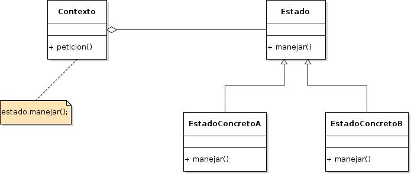

# State

## Propósito

Según el libro "Patrones de Diseño" [\[29\]](../../../recursos.md) el patrón _State_ "permite que un objeto modifique su comportamiento cada vez que cambie su estado interno. Parecerá que cambia la clase del objeto".

## También conocido como

_Objects for states_ \(Estados como Objetos\)

## Estructura



## Participantes

* **Contexto:**
  * define la interfaz de interés para los clientes.
  * mantiene una variable de un subtipo de dato de EstadoConcreto que define el estado actual.
* **Estado:**
  * define una interfaz para encapsular el comportamiento asociado con un determinado estado del Contexto.
* **Subtipos de Datos de EstadoConcreto:**
  * cada subtipo de dato implementa un comportamiento asociado con un estado del Contexto.

## Implementación

* No se observan impedimentos y/o modificaciones de la estructura original del patrón para su implementación en _Go_.
* El _Estado_ se define como interface por simplificación.

## Código de ejemplo

En este ejemplo queremos escribir texto en base al estado de una botonera de estilos, pudiendo ser estos estados "negrita" o "cursiva".

Implementación:

```go
// Interface Estado
type Estado interface {
    Escribir(string) string
}

// Estado Concreto
type EstadoNegrita struct{}

func (en *EstadoNegrita) Escribir(texto string) string {
    return "*" + texto + "*"
}

// Estado Concreto
type EstadoCursiva struct{}

func (ec *EstadoCursiva) Escribir(texto string) string {
    return "_" + texto + "_"
}

// Contexto
type EditorMarkdown struct {
    estado Estado
}

func (em *EditorMarkdown) SetEstado(estado Estado) {
    em.estado = estado
}

func (em *EditorMarkdown) Redactar(texto string) string {
    if em.estado == nil {
        return texto
    }

    return em.estado.Escribir(texto)
}
```

Se puede probar la implementación del patrón de la siguiente forma:

```go
editor := &EditorMarkdown{}
fmt.Printf("Texto redactado sin estado: %s\n", editor.Redactar("Lorem ipsum"))

editor.SetEstado(&EstadoNegrita{})
fmt.Printf("Texto redactado en negrita: %s\n", editor.Redactar("Lorem ipsum"))

editor.SetEstado(&EstadoCursiva{})
fmt.Printf("Texto redactado en cursiva: %s\n", editor.Redactar("Lorem ipsum"))
```

[Código de ejemplo](https://github.com/danielspk/designpatternsingo/tree/master/patrones/comportamiento/state) \| [Ejecutar código](https://play.golang.org/p/KsYfTyLBDVI)


> **Atención**: Esta publicación se encuentra abandonada. Puede acceder a la versión vigente en [https://leanpub.com/designpatternsingo](https://leanpub.com/designpatternsingo)

