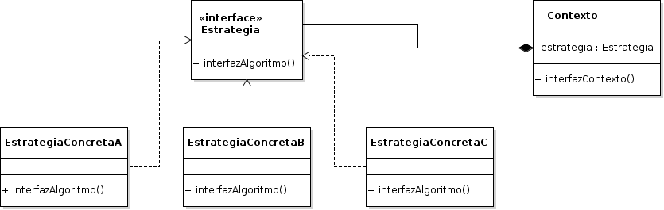

# Strategy

## Propósito

Según el libro "Patrones de Diseño" [\[29\]](../../../recursos.md) el patrón _Strategy_ "define una familia de algoritmos, encapsula cada uno de ellos y los hace intercambiables. Permite que un algoritmo varíe independientemente de los clientes que lo usan".

## También conocido como

_Policy_

## Estructura



## Participantes

* **Estrategia:**
  * declara la interfaz común a todos los algoritmos permitidos. El _Contexto_ usa esta interfaz para llamar al algoritmo definido por una _EstrategiaConcreta_.
* **EstrategiaConcreta:**
  * implementa el algoritmo usando la interfaz _Estrategia_.
* **Contexto:**
  * se configura con una variable _EstrategiaConcreta_.
  * mantiene una referencia a una variable _Estrategia_.
  * puede definir una interfaz que permita a la _Estrategia_ acceder a sus datos.

## Implementación

No se observan impedimentos y/o modificaciones de la estructura original del patrón para su implementación en _Go_.

## Código de ejemplo

En este ejemplo queremos definir tres estrategias concretas que pueden realizar distintas operaciones matemáticas. Cuando se crea el contexto se establece que estrategia deberá utilizar.

Implementación:

```go
// Interface
type Estrategia interface {
    RealizarOperacion(int, int) int
}

// Estrategia Suma
type EstrategiaSuma struct{}

func (e EstrategiaSuma) RealizarOperacion(num1 int, num2 int) int {
    return num1 + num2
}

// Estrategia Resta
type EstrategiaResta struct{}

func (e EstrategiaResta) RealizarOperacion(num1 int, num2 int) int {
    return num1 - num2
}

// Estrategia Multiplica
type EstrategiaMultiplica struct{}

func (e EstrategiaMultiplica) RealizarOperacion(num1 int, num2 int) int {
    return num1 * num2
}

// Contexto
type Contexto struct {
    estrategia Estrategia
}

func (c *Contexto) EjecutarOperacion(num1 int, num2 int) int {
    return c.estrategia.RealizarOperacion(num1, num2)
}
```

Se puede probar la implementación del patrón de la siguiente forma:

```go
var contexto Contexto
num1 := 10
num2 := 5

contexto = Contexto{EstrategiaSuma{}}
fmt.Printf("%d + %d = %d\n", num1, num2, contexto.EjecutarOperacion(num1, num2))

contexto = Contexto{EstrategiaResta{}}
fmt.Printf("%d - %d = %d\n", num1, num2, contexto.EjecutarOperacion(num1, num2))

contexto = Contexto{EstrategiaMultiplica{}}
fmt.Printf("%d * %d = %d\n", num1, num2, contexto.EjecutarOperacion(num1, num2))
```

[Código de ejemplo](https://github.com/danielspk/designpatternsingo/tree/master/patrones/comportamiento/strategy) \| [Ejecutar código](https://play.golang.org/p/OoMEcPgef7e)


> **Atención**: Esta publicación se encuentra abandonada. Puede acceder a la versión vigente en [https://leanpub.com/designpatternsingo](https://leanpub.com/designpatternsingo)

