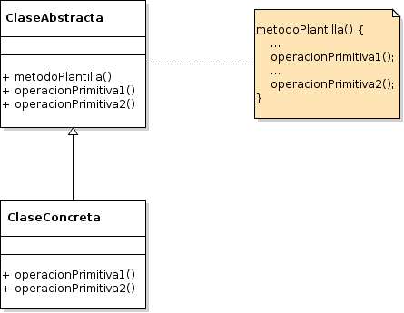

# Template Method

## Propósito

Según el libro "Patrones de Diseño" [\[29\]](../../../recursos.md) el patrón _Template Method_ "define en una operación el esqueleto de un algoritmo, delegando en las subclases algunos de sus pasos. Permite que las subclases redefinan ciertos pasos de un algoritmo sin cambiar su estructura".

## Estructura



## Participantes

* **ClaseAbstracta:**
  * define operaciones primitivas abstractas que son definidas por los subtipos de datos para implementar los pasos de un algoritmo.
  * implementa una función plantilla que define el esqueleto de un algoritmo. La función plantilla llama a las operaciones primitivas así como a operaciones definidas en ClaseAbstracta o a las de otras variables.
* **ClaseConcreta:**
  * implementa las operaciones primitivas para realizar los pasos del algoritmo específicos de los subtipos de datos.

## Implementación

* No se observan impedimentos para su implementación en _Go_.
* En este caso, dado que no existe la herencia de clase en _Go_, la _ClaseAbstracta_ sugerida por el patrón debe implementarse en dos partes: a\) por un lado los comportamientos abstractos deben definirse en una _Interface_, y b\) por otro lado los comportamientos concretos \(_el método plantilla_\) dentro del propio tipo _ClaseAbstracta_.
* Las _ClasesConcretas_ se componen \(_en vez de heredar_\) de una _ClaseConcreta_.
* Las _ClasesConcretas_ implementan los comportamientos de la _Interface_.
* La principal dificultad de implementar este patrón en _Go_ es que el comportamiento del método plantilla de la _ClaseAbstracta_ invoca a otros comportamientos que no están definidos dentro de la propia _ClaseAbstracta_ sino dentro de la _ClaseConcreta_. Esto obliga a que cuando se invoca el método plantilla desde una _ClaseConcreta_ se deba pasar una referencia de si misma para que el método plantilla pueda invocar los comportamientos definidos en la _Interface_.

> Dada esta complejidad adicional léase esta forma de implementación junto al código de ejemplo del patrón.

## Código de ejemplo

En este ejemplo queremos cumplir con una serie de pasos formales _\(método plantilla\)_ para desplegar diferentes aplicaciones móviles.

Implementación:

```go
// Clase Abstracta - Interface
type DeployInterface interface {
    Testear()
    Compilar()
    Publicar()
}

// Clase Abstracta
type Deploy struct{}

// Método Plantilla
func (d Deploy) Construir(di DeployInterface) {
    fmt.Println("Ejecutando las siguientes acciones:")

    di.Testear()
    di.Compilar()
    di.Publicar()
}

// Clase Concreta - Android
type DeployAndroid struct {
    Deploy
}

func (d DeployAndroid) Testear() {
    fmt.Println("Android: Testeando")
}

func (d DeployAndroid) Compilar() {
    fmt.Println("Android: Compilando")
}

func (d DeployAndroid) Publicar() {
    fmt.Println("Android: Publicando")
}

// Clase Concreta - iOS
type DeployiOS struct {
    Deploy
}

func (d DeployiOS) Testear() {
    fmt.Println("iOS: Testeando")
}

func (d DeployiOS) Compilar() {
    fmt.Println("iOS: Compilando")
}

func (d DeployiOS) Publicar() {
    fmt.Println("iOS: Publicando")
}
```

Se puede probar la implementación del patrón de la siguiente forma:

```go
deployAndroid := DeployAndroid{Deploy{}}
deployAndroid.Construir(&deployAndroid)

deployiOS := DeployiOS{Deploy{}}
deployiOS.Construir(&deployiOS)
```

[Código de ejemplo](https://github.com/danielspk/designpatternsingo/tree/master/patrones/comportamiento/templatemethod) \| [Ejecutar código](https://play.golang.org/p/1J-MIDMaXi5)

Implementación alternativa:

En esta alternativa no es necesario pasar la propia referencia del tipo concreto en el método `Construir`. La construcción del tipo concreto se realiza componiéndolo con un tipo abstracto compuesto con el mismo tipo concreto.

```go
// Clase Abstracta - Interface
type DeployInterface interface {
    Testear()
    Compilar()
    Publicar()
}

// Clase Abstracta
type Deploy struct{
    DeployInterface
}

// Método Plantilla
func (d Deploy) Construir() {
    fmt.Println("Ejecutando las siguientes acciones:")

    d.Testear()
    d.Compilar()
    d.Publicar()
}

// Clase Concreta - Android
type DeployAndroid struct {
    Deploy
}

func (d DeployAndroid) Testear() {
    fmt.Println("Android: Testeando")
}

func (d DeployAndroid) Compilar() {
    fmt.Println("Android: Compilando")
}

func (d DeployAndroid) Publicar() {
    fmt.Println("Android: Publicando")
}
```

Se puede probar la implementación alternativa del patrón de la siguiente forma:

```go
deployAndroid := DeployAndroid{Deploy{DeployAndroid{}}}
deployAndroid.Construir()
```

[Ejecutar código](https://play.golang.org/p/u5df18NIRI1)


> **Atención**: Esta publicación se encuentra abandonada. Puede acceder a la versión vigente en [https://leanpub.com/designpatternsingo](https://leanpub.com/designpatternsingo)

