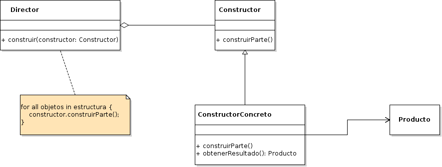

# Builder

## Propósito

Separa la construcción de una variable compleja de su representación, de forma que el mismo proceso de construcción pueda crear diferentes representaciones.

## Estructura



## Participantes

* **Constructor:**
  * especifica una interfaz abstracta para crear las partes de una variable Producto.
* **ConstructorConcreto:**
  * implementa la interfaz de Constructor para construir y ensamblar las partes del producto.
  * proporciona una interfaz para devolver el producto.
* **Director:**
  * construye una variable usando la interfaz Constructor.
* **Producto:**
  * representa una variable compleja en construcción. El ConstructorConcreto construye la representación interna del producto y define el proceso de ensamble.
  * incluye los tipos de datos que definen sus partes constituyentes, incluyendo interfaces para ensamblar las partes en el resultado final.

## Implementación

* No se observan impedimentos y/o modificaciones de la estructura original del patrón para su implementación en _Go_.
* El _Constructor_ se define como interface por simplificación.

## Código de ejemplo

En este ejemplo queremos que un local de comida pueda entregar distintos tipos de hamburguesas \(simples y dobles\) para lo que será necesario generar distintos constructores de hamburguesas.

Implementación:

```go
// Interface Constructor
type Constructor interface {
    EstablecerTamanio()
    Construir() *Hamburguesa
}

// Constructor Concreto
type ConstructorHamburguesaSimple struct {
    tamanio string
}

func (chs *ConstructorHamburguesaSimple) EstablecerTamanio() {
    chs.tamanio = "Simple"
}

func (chs *ConstructorHamburguesaSimple) Construir() *Hamburguesa {
    return &Hamburguesa{chs.tamanio}
}

// Constructor Concreto
type ConstructorHamburguesaDoble struct {
    tamanio string
}

func (chd *ConstructorHamburguesaDoble) EstablecerTamanio() {
    chd.tamanio = "Doble"
}

func (chd *ConstructorHamburguesaDoble) Construir() *Hamburguesa {
    return &Hamburguesa{chd.tamanio}
}

// Producto
type Hamburguesa struct {
    Tamanio string
}

// Director
type LocalComida struct{}

func (lc *LocalComida) ConstruirHamburguesa(constructor Constructor) *Hamburguesa {
    constructor.EstablecerTamanio()

    return constructor.Construir()
}
```

Se puede probar la implementación del patrón de la siguiente forma:

```go
localComida := &LocalComida{}

hamburguesaA := localComida.ConstruirHamburguesa(&ConstructorHamburguesaSimple{})
hamburguesaB := localComida.ConstruirHamburguesa(&ConstructorHamburguesaDoble{})

fmt.Printf("Se solicito una hamburguesa: %s\n", hamburguesaA.Tamanio)
fmt.Printf("Se solicito una hamburguesa: %s\n", hamburguesaB.Tamanio)
```

[Código de ejemplo](https://github.com/danielspk/designpatternsingo/tree/master/patrones/creacionales/builder) \| [Ejecutar código](https://play.golang.org/p/5dPp1a1Yaw_F)

