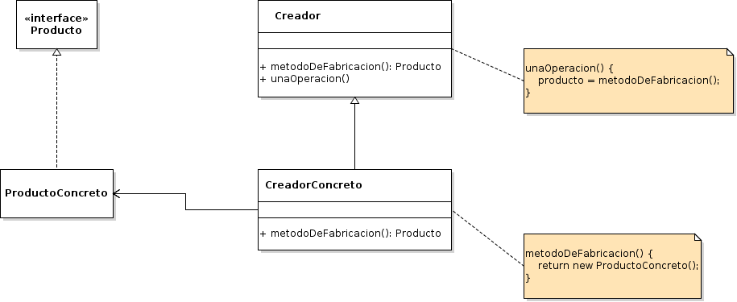

# Factory Method

## Propósito

Según el libro "Patrones de Diseño" [\[29\]](../../../recursos.md) el patrón _Factory Method_ "define una interfaz para crear un objeto, pero deja que sean las subclases quienes decidan qué clase instanciar. Permite que una clase delegue en sus subclases la creación de objetos".

## También conocido como

_Virtual Constructor_ \(Constructor Virtual\)

## Estructura



## Participantes

* **Producto:**
  * define la interfaz de las variables que crea el método de fabricación.
* **ProductoConcreto:**
  * implementa la interfaz Producto.
* **Creador:**
  * declara el método de fabricación, el cual devuelve una variable de tipo Producto. También puede definir una implementación predeterminada del método de fabricación que devuelva una variable ProductoConcreto.
  * puede llamar al método de fabricación para crear una variable Producto.
* **CreadorConcreto:**
  * redefine el método de fabricación para devolver una variable de un ProductoConcreto.

## Implementación

* No se observan impedimentos para su implementación en _Go_.
* En este caso, dado que no existe la herencia de clase en _Go_, el _Creador_ sugerido por el patrón debe implementarse en dos partes: a\) por un lado los comportamientos abstractos deben definirse en una _Interface_, y b\) por otro lado los comportamientos concretos \(_el método una operación_\) dentro del propio tipo de dato _Creador_.
* Los _CreadoresConcretos_ se componen \(_en vez de heredar_\) de un _Creador_.
* Los _CreadoresConcretos_ implementan los comportamientos de la _InterfaceCreador_.
* La principal dificultad de implementar este patrón en _Go_ es que existe un comportamiento concreto en _Creador_ que invoca a otros comportamientos que no están definidos dentro del propio _Creador_ sino que están dentro del _CreadorConcreto_ que implementa la _InterfaceCreador_. Esto obliga a que cuando se invoca el comportamiento concreto de _Creador_ desde un _CreadorConcreto_ se deba pasar una referencia de si mismo para que el comportamiento concreto pueda invocar los comportamientos definidos en la _InterfaceCreador_.

## Código de ejemplo

En este ejemplo queremos contratar personas con diferentes perfiles profesionales. A medida que los postulantes lleguen a la oficina de recursos humanos serán entrevistados \(construidor\) por diferentes reclutadores especializados.

Implementación:

```go
// Interface Producto
type Entrevistador interface {
    RealizarPreguntas()
}

// Producto Concreto
type EntrevistadorIT struct{}

func (e *EntrevistadorIT) RealizarPreguntas() {
    fmt.Println("¿Nombre 5 patrones de diseño?")
}

// Producto Concreto
type EntrevistadorFinanzas struct{}

func (e *EntrevistadorFinanzas) RealizarPreguntas() {
    fmt.Println("¿Cuál es la alicuota del IVA?")
}

// Creador Interface
type RecursosHumanosInterface interface {
    LlamarEntrevistador() Entrevistador
}

// Creador Abstracto
type RecursosHumanos struct{}

func (rh *RecursosHumanos) TomarEntrevista(self RecursosHumanosInterface) {
    entrevistador := self.LlamarEntrevistador()
    entrevistador.RealizarPreguntas()
}

// Creador Concreto
type RecusosHumanosIT struct {
    *RecursosHumanos
}

func (rhi *RecusosHumanosIT) LlamarEntrevistador() Entrevistador {
    return &EntrevistadorIT{}
}

// Creador Concreto
type RecusosHumanosFinanzas struct {
    *RecursosHumanos
}

func (rhf *RecusosHumanosFinanzas) LlamarEntrevistador() Entrevistador {
    return &EntrevistadorFinanzas{}
}
```

Se puede probar la implementación del patrón de la siguiente forma:

```go
fmt.Println("El entrevisatador de IT pregunta:")
recursosHumanosIT := &RecusosHumanosIT{&RecursosHumanos{}}
recursosHumanosIT.TomarEntrevista(recursosHumanosIT)

fmt.Println("\nEl entrevisatador de Finanzas pregunta:")
recursosHumanosFinanzas := &RecusosHumanosFinanzas{&RecursosHumanos{}}
recursosHumanosFinanzas.TomarEntrevista(recursosHumanosFinanzas)
```

[Código de ejemplo](https://github.com/danielspk/designpatternsingo/tree/master/patrones/creacionales/factorymethod) \| [Ejecutar código](https://play.golang.org/p/1szkQi-rVUf)

