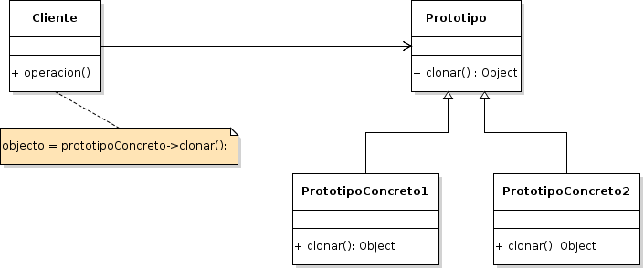

# Prototype

## Propósito

Según el libro "Patrones de Diseño" [\[29\]](../../../recursos.md) el patrón _Prototype_ "especifica los tipos de objetos a crear por medio de una instancia prototípica, y crea nuevos objetos copiando dicho prototipo".

## Estructura



## Participantes

* **Prototipo:**
  * declara la interfaz para clonarse.
* **PrototipoConcreto:**
  * implementa una operación para clonarse.
* **Cliente:**
  * crea una variable pidiéndole a un prototipo que se clone.

## Implementación

No se observan impedimentos y/o modificaciones de la estructura original del patrón para su implementación en _Go_.

## Código de ejemplo

En este ejemplo queremos que un elemento químico sea capaz de clonarse a sí mismo indicando cuantas veces fue clonado.

Implementación:

```go
// Prototipo Interface
type Prototipo interface {
    Clonar() *Elemento
}

// Prototipo Concreto
type Elemento struct {
    Material string
    Copias   int
}

func (e *Elemento) Clonar() *Elemento {
    return &Elemento{
        Material: e.Material,
        Copias:   e.Copias + 1,
    }
}
```

Se puede probar la implementación del patrón de la siguiente forma:

```go
elementoA := &Elemento{"Azufre", 1}

elementoB := elementoA.Clonar()
elementoB.Material = elementoB.Material + " (fortificado)"

elementoC := elementoB.Clonar()

fmt.Printf("El elemento A es de %s y se clono %d veces\n", elementoA.Material, elementoA.Copias)
fmt.Printf("El elemento B es de %s y se clono %d veces\n", elementoB.Material, elementoB.Copias)
fmt.Printf("El elemento C es de %s y se clono %d veces\n", elementoC.Material, elementoC.Copias)
```

[Código de ejemplo](https://github.com/danielspk/designpatternsingo/tree/master/patrones/creacionales/prototype) \| [Ejecutar código](https://play.golang.org/p/3OAK3-IzcTT)

