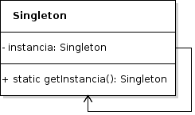

# Singleton

## Propósito

Garantiza que un tipo de dato sólo tenga una variable de creación, y proporciona un punto de acceso global a ella.

## Estructura



## Participantes

* **Singleton:**
  * define una operación _instancia_ que permite que los clientes accedan a su única variable.
  * puede ser responsable de crear su única variable en memoria.

## Implementación

* No se observan impedimentos para la implementación del patrón en _Go_.
* Al no existir método y propiedades estáticas en _Go_ es necesario utilizar programación funcional para poder implementar el patrón.
* Dado que _Go_ permite la programación concurrente en diferentes subprocesos de ejecución, no es posible garantizar una única variable del tipo de dato si no se toman recaudos adicionales. Para asegurar que sólo existirá una variable del tipo de dato se deberá hacer uso de la librería estándar [sync](https://golang.org/pkg/sync/) de _Go_. Concretamente el método [Do](https://golang.org/pkg/sync/#Once.Do) de la estructura [Once](https://golang.org/pkg/sync/#Once) garantiza que la función pasada como parámetro puede ser ejecutada una única vez mientra dure la ejecución del programa. Esta función será la encargada de crear la única variable del tipo de dato _Singleton_.

## Código de ejemplo

Implementación:

```go
// Singleton
type Singleton struct {
    Tiempo int64
}

// Creador "estático"
var instancia *Singleton
var once sync.Once

func GetInstancia() *Singleton {
    once.Do(func() {
        instancia = &Singleton{
            time.Now().Unix(),
        }
    })

    return instancia
}
```

Se puede probar la implementación del patrón de la siguiente forma:

```go
fmt.Println("Todas las instancias Singleton tienen que tener el mismo número")

fmt.Printf("Instancia Singleton: %d\n", GetInstancia().Tiempo)

time.Sleep(1 * time.Second)

fmt.Printf("Instancia Singleton: %d\n", GetInstancia().Tiempo)

canalEspera := make(chan int64)

go func() {
    time.Sleep(1 * time.Second)

    canalEspera <- GetInstancia().Tiempo
}()

fmt.Printf("Instancia Singleton: %d\n", <-canalEspera)
```

[Código de ejemplo](https://github.com/danielspk/designpatternsingo/tree/master/patrones/creacionales/singleton) \| [Ejecutar código](https://play.golang.org/p/Fae3WyvrdIf)

