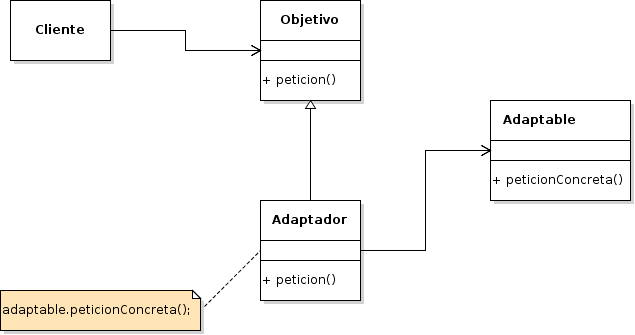

# Adapter

## Propósito

Según el libro "Patrones de Diseño" [\[29\]](../../../recursos.md) el patrón _Adapter_ "convierte la interfaz de un tipo de dato en otra interfaz que es la que esperan los clientes. Permite que cooperen tipos de datos que de otra forma no podrían por tener interfaces incompatibles".

## También conocido como

_Wrapper_ \(Envoltorio\)

## Estructura



## Participantes

* **Objetivo:**
  * define la interfaz específica del dominio que usa el Cliente.
* **Cliente:**
  * colabora con variables que se ajustan a la interfaz Objetivo.
* **Adaptable:**
  * define una interfaz existente que necesita ser adaptada.
* **Adaptador:**
  * adapta la interfaz de Adaptable a la interfaz Objetivo.

## Implementación

No se observan impedimentos y/o modificaciones de la estructura original del patrón para su implementación en _Go_.

## Código de ejemplo

En este ejemplo queremos que un juego de RPG se pueda adaptar a un nuevo tipo de personaje \(_Magos_\) que no comparte las mismas características que los guerreros originales \(_Elfos_\). Para esto es necesario realizar un adaptador para que un _Mago_ pueda atacar como un _Elfo_.

Implementación:

```go
// Objetivo
type Gerrero interface {
    UsarArma() string
}

type Elfo struct{}

func (e *Elfo) UsarArma() string {
    return "atacando con arco y flecha"
}

// Adaptable
type GerreroMagico interface {
    UsarMagia() string
}

type Mago struct{}

func (m *Mago) UsarMagia() string {
    return "atacando con magia"
}

// Adaptador
type MagoAdaptador struct {
    gerrero GerreroMagico
}

func (ma *MagoAdaptador) UsarArma() string {
    return ma.gerrero.UsarMagia()
}

// Cliente
type Jugador struct {
    guerrero Gerrero
}

func (j *Jugador) Atacar() string {
    return j.guerrero.UsarArma()
}
```

Se puede probar la implementación del patrón de la siguiente forma:

```go
jugadorA := &Jugador{&Elfo{}}
fmt.Printf("Jugador A: %s\n", jugadorA.Atacar())

jugadorB := &Jugador{&MagoAdaptador{&Mago{}}}
fmt.Printf("Jugador B: %s\n", jugadorB.Atacar())odos los desarrolladores de la Gerencia es de $%d\n", gerenciaIT.ObtenerSalario())
```

[Código de ejemplo](https://github.com/danielspk/designpatternsingo/tree/master/patrones/estructurales/adapter) \| [Ejecutar código](https://play.golang.org/p/60tlY8la04W)

