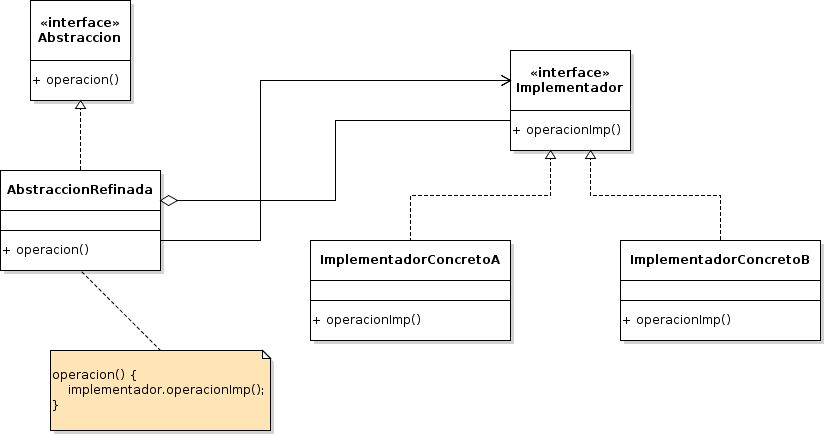

# Bridge

## Propósito

Según el libro "Patrones de Diseño" [\[29\]](../../../recursos.md) el patrón _Bridge_ "desacopla una abstracción de su implementación, de modo que ambas puedan variar de forma independiente".

## También conocido como

_Handle/Body_ \(Manejador/Cuerpo\)

## Estructura



## Participantes

* **Abstraccion:**
  * define la interfaz de la abstracción.
  * mantiene una referencia a una variable de tipo Implementador.
* **AbstraccionRefinada:**
  * extiende la interfaz definida por Abstraccion.
* **Implementador:**
  * define la interfaz de los tipos de datos de implementación. Esta interfaz no tiene por qué corresponderse exactamente con la de Abstracción; de hecho, ambas interfaces pueden ser muy distintas. Normalmente la interfaz Implementador solo proporciona operaciones primitivas, y Abstraccion define operaciones de más alto nivel basadas en dichas primitivas.
* **ImplementadorConcreto:**
  * implementa la interfaz Implementador y define su implementación concreta.

## Implementación

* No se observan impedimentos para su implementación en _Go_.
* En este caso, dado que _Abstraccion_ se define como una interface pero a la vez también implementando comportamiento concreto para mantener la referencia del tipo de dato _Implementador_, se separará en dos partes en dos partes: a\) por un lado los comportamientos abstractos deben definirse en una interface _Abstraccion Interface_, y b\) por otro lado los comportamientos concretos \(_el que mantiene una referencia del Implementador_\) dentro de un tipo de dato _Abstraccion Abstracta_.
* Las _Abstracciones Refinadas_ se componen \(_en vez de heredar_\) de  _Abstraccion Abstracta_.

## Código de ejemplo

En este ejemplo queremos desacoplar el protocolo de conexión a internet que pueden implementar distintos dispositivos.

Implementación:

```go
// Abstraccion Interface
type DispositivoInterface interface {
    ConectarInternet() string
    SetConexion(Conexion)
}

// Abstraccion Abstracta
type Dispositivo struct {
    conexion Conexion
}

func (d *Dispositivo) SetConexion(conexion Conexion) {
    d.conexion = conexion
}

// Abstraccion Refinada
type Telefono struct {
    numero string
    *Dispositivo
}

func (t *Telefono) ConectarInternet() string {
    return "Teléfono N° " + t.numero + " conectado a internet mediante " + t.conexion.Conectar()
}

// Abstraccion Refinada
type Tablet struct {
    *Dispositivo
}

func (t *Tablet) ConectarInternet() string {
    return "Tablet conectada a internet mediante " + t.conexion.Conectar()
}

// Implementador Interface
type Conexion interface {
    Conectar() string
}

// Implementador Concreto
type Red4G struct{}

func (r *Red4G) Conectar() string {
    return "4G"
}

// Implementador Concreto
type RedWiFi struct{}

func (r *RedWiFi) Conectar() string {
    return "WiFi"
}
```

Se puede probar la implementación del patrón de la siguiente forma:

```go
telefonoA := &Telefono{"0115161", &Dispositivo{}}
telefonoA.SetConexion(&Red4G{})
fmt.Printf("%s\n", telefonoA.ConectarInternet())

telefonoB := &Telefono{"0117854", &Dispositivo{}}
telefonoB.SetConexion(&RedWiFi{})
fmt.Printf("%s\n", telefonoB.ConectarInternet())

tablet := &Tablet{&Dispositivo{}}
tablet.SetConexion(&RedWiFi{})
fmt.Printf("%s\n", tablet.ConectarInternet())
```

[Código de ejemplo](https://github.com/danielspk/designpatternsingo/tree/master/patrones/estructurales/bridge) \| [Ejecutar código](https://play.golang.org/p/PnQdNHLsrSc)


> **Atención**: Esta publicación se encuentra abandonada. Puede acceder a la versión vigente en [https://leanpub.com/designpatternsingo](https://leanpub.com/designpatternsingo)

