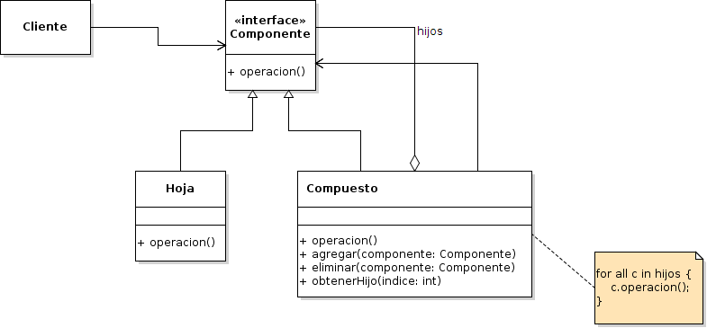

# Composite

## Propósito

Según el libro "Patrones de Diseño" [\[29\]](../../../recursos.md) el patrón _Composite_ "compone objetos en estructuras de árbol para representar jerarquías de parte-todo. Permite que los clientes traten de manera uniforme a los objetos individuales y a los compuestos".

## Estructura



## Participantes

* **Componente:**
  * declara la interfaz de las variables de la composición.
  * implementa el comportamiento predeterminado de la interfaz que es común a todos los tipos de datos.
  * declara una interfaz para acceder a sus componentes hijos y gestionarlos.
  * _\(opcional\)_ define una interfaz para acceder al padre de un componente en la jerarquía recursiva y, si es necesario, la implementa.
* **Hoja:**
  * representa variables hoja en la composición. Una hoja no tiene hijos.
  * define el comportamiento de las variables primitivas de la composición.
* **Compuesto:**
  * define el comportamiento de los componentes que tienen hijos.
  * almacena componentes hijos.
  * implementa las operaciones de la interfaz Componente relacionadas con los hijos.
* **Cliente:**
  * manipula variables en la composición a través de la interfaz Componente.

## Implementación

No se observan impedimentos y/o modificaciones de la estructura original del patrón para su implementación en _Go_.

## Código de ejemplo

En este ejemplo queremos acceder a los salarios de los empleados de una gerencia tanto de forma individual como grupal. De esta forma la compañia podría analizar el impacto de futuros bonos de productividad tanto para una gerencia completa o para alguno de sus empleados.

Implementación:

```go
// Componente Interface
type Empleado interface {
    ObtenerSalario() int
}

// Hoja
type DesarrolladorSenior struct{}

func (ds *DesarrolladorSenior) ObtenerSalario() int {
    return 1000
}

// Hoja
type DesarrolladorJunior struct{}

func (dj *DesarrolladorJunior) ObtenerSalario() int {
    return 750
}

// Compuesto
type GerenciaIT struct {
    empleados []Empleado
}

func (g *GerenciaIT) AgregarEmpleado(empleado Empleado) {
    g.empleados = append(g.empleados, empleado)
}

func (g *GerenciaIT) ObtenerSalario() int {
    sumaSalarios := 0

    for _, empleado := range g.empleados {
        sumaSalarios = sumaSalarios + empleado.ObtenerSalario()
    }

    return sumaSalarios
}
```

Se puede probar la implementación del patrón de la siguiente forma:

```go
empleadoA := &DesarrolladorJunior{}
empleadoB := &DesarrolladorJunior{}
empleadoC := &DesarrolladorSenior{}

gerenciaIT := &GerenciaIT{}
gerenciaIT.AgregarEmpleado(empleadoA)
gerenciaIT.AgregarEmpleado(empleadoB)
gerenciaIT.AgregarEmpleado(empleadoC)

fmt.Printf("El salario individual del desarrollador A es de $%d\n", empleadoA.ObtenerSalario())
fmt.Printf("El salario individual del desarrollador B es de $%d\n", empleadoB.ObtenerSalario())
fmt.Printf("El salario individual del desarrollador C es de $%d\n", empleadoC.ObtenerSalario())
fmt.Printf("Los salarios de todos los desarrolladores de la Gerencia es de $%d\n", gerenciaIT.ObtenerSalario())
```

[Código de ejemplo](https://github.com/danielspk/designpatternsingo/tree/master/patrones/estructurales/composite) \| [Ejecutar código](https://play.golang.org/p/BR_zwXpOD0O)

