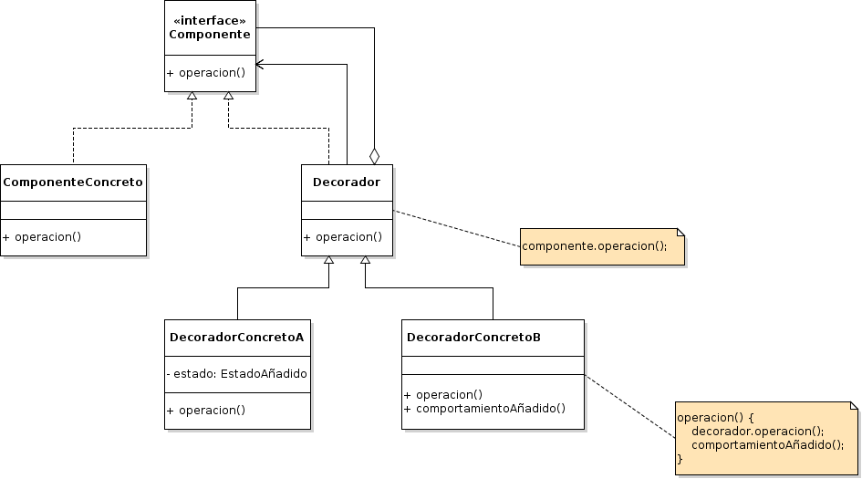

# Decorator

## Propósito

Según el libro "Patrones de Diseño" [\[29\]](../../../recursos.md) el patrón _Decorator_ "asigna responsabilidades adicionales a una variable dinámicamente, proporcionando una alternativa flexible a la herencia _\(composición\)_ para extender la funcionalidad".

## También conocido como

_Wrapper_ \(Envoltorio\)

## Estructura



## Participantes

* **Componente:**
  * define la interfaz para variables a las que se puede añadir responsabilidades dinámicamente.
* **ComponenteConcreto:**
  * define una variable a la que se pueden añadir responsabilidades adicionales.
* **Decorador:**
  * mantiene una referencia a una variable Componente y define una interfaz que se ajusta a la interfaz del Componente.
* **DecoradorConcreto:**
  * añade responsabilidades al componente.

## Implementación

No se observan impedimentos y/o modificaciones de la estructura original del patrón para su implementación en _Go_.

## Código de ejemplo

En este ejemplo queremos agregarle dinámicamente ingredientes adicionales a un un cafe que por defecto viene simple.

Implementación:

```go
// Componente Interface
type CafeInterface interface {
    GetCosto() int
    GetDetalle() string
}

// Componente Concreto
type Cafe struct{}

func (c *Cafe) GetCosto() int {
    return 30
}

func (c *Cafe) GetDetalle() string {
    return "Cafe"
}

// Decorador
type CafeDecorador struct {
    CafeInterface
}

func (cd *CafeDecorador) GetCosto() int {
    return cd.CafeInterface.GetCosto()
}

func (cd *CafeDecorador) GetDetalle() string {
    return cd.CafeInterface.GetDetalle()
}

// Decorador Concreto
type CafeConCrema struct {
    *CafeDecorador
}

func (ccc *CafeConCrema) GetCosto() int {
    return ccc.CafeDecorador.GetCosto() + 15
}

func (ccc *CafeConCrema) GetDetalle() string {
    return ccc.CafeDecorador.GetDetalle() + " con crema"
}

// Decorador Concreto
type CafeConCanela struct {
    *CafeDecorador
}

func (ccc *CafeConCanela) GetCosto() int {
    return ccc.CafeDecorador.GetCosto() + 10
}

func (ccc *CafeConCanela) GetDetalle() string {
    return ccc.CafeDecorador.GetDetalle() + " con canela"
}
```

Se puede probar la implementación del patrón de la siguiente forma:

```go
cafe := &Cafe{}
fmt.Printf("Detalle: %s - Importe $%d\n", cafe.GetDetalle(), cafe.GetCosto())

cafeConCrema := &CafeConCrema{&CafeDecorador{cafe}}
fmt.Printf("Detalle: %s - Importe $%d\n", cafeConCrema.GetDetalle(), cafeConCrema.GetCosto())

cafeConCremaConCanela := &CafeConCanela{&CafeDecorador{cafeConCrema}}
fmt.Printf("Detalle: %s - Importe $%d\n", cafeConCremaConCanela.GetDetalle(), cafeConCremaConCanela.GetCosto())
```

[Código de ejemplo](https://github.com/danielspk/designpatternsingo/tree/master/patrones/estructurales/decorator) \| [Ejecutar código](https://play.golang.org/p/62xDpf7XUv_m)

