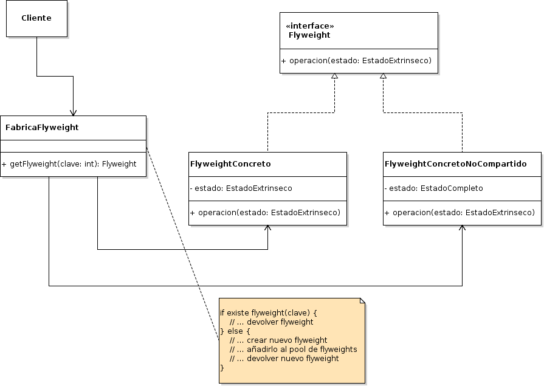

# Flyweight

## Propósito

Usa comportamiento para permitir un gran número de variables de grano fino de forma eficiente.

## Estructura



## Participantes

* **Flyweight:**
  * declara una interfaz a travéz de la cual los flyweight concretos pueden recibir un estado extrínseco y actuar sobre él.
* **FlyweightConcreto:**
  * implementa la interfaz Flyweight y permite almacenar el estado intrínseco, en caso de que lo haya. Una variable FlyweightConcreto debe poder ser compartida, por lo que cualquier estado que almacene debe ser intrínseco, esto es, debe ser independiente del contexto de la variable FlyweightConcreto.
* **FlyweightConcretoNoCompartido:**
  * no todas los subtipos de datos de Flyweight necesitan ser compartidas. La interfaz Flyweight permite el comportamiento, no fuerza a él. Las variables FlyweightConcretoNoCompartido suelen tener variables FlyweightConcreto como hijos en algún nivel de la jerarquía de variables.
* **FabricaFlyweight:**
  * crea y controla variables flyweight.
  * garantiza  que los flyweight se compartan de manera adecuada. Cuando un cliente solicita un flyweight, la variable FabricaFlyweight proporciona una variable concreta o crea una nueva, en caso de que no exista ninguna.
* **Cliente:**
  * mantiene una referencia a los flyweight.
  * culcula o guarda el estado extrínseco de los flyweight.

## Implementación

No se observan impedimentos y/o modificaciones de la estructura original del patrón para su implementación en _Go_.

## Código de ejemplo

En este ejemplo queremos que nuestro sistema sea capaz de dibujar controles en la pantalla haciendo un uso eficiente de los recursos ya que existen controles \(los botones\) que pueden ser reutilizados.

Implementación:

```go
// Flyweight Interface
type Control interface {
    Dibujar(x string, y string) string
    GetReferencia() string
}

// Flyweight Concreto
type Boton struct {
    referencia string
}

func (b *Boton) Dibujar(x string, y string) string {
    return "Dibujando Botón #" + b.referencia + " en ejes " + x + ", " + y
}

func (b *Boton) GetReferencia() string {
    return b.referencia
}

// Flyweight Concreto No Compartido
type CampoPassword struct{}

func (cp *CampoPassword) Dibujar(x string, y string) string {
    return "Dibujando Campo de Password en ejes " + x + ", " + y
}

func (cp *CampoPassword) GetReferencia() string {
    return ""
}

// Fabrica Flyweight
type PantallaFabrica struct {
    controles []Control
}

func (pb *PantallaFabrica) ObtenerControl(tipo string, referencia string, x string, y string) string {
    for _, control := range pb.controles {
        if control.GetReferencia() == referencia {
            return control.Dibujar(x, y) + " || <control recuperado>"
        }
    }

    if tipo == "BOTON" {
        control := &Boton{referencia}

        pb.controles = append(pb.controles, control)

        return control.Dibujar(x, y)
    }

    if tipo == "PASSWORD" {
        control := &CampoPassword{}

        return control.Dibujar(x, y)
    }

    return ""
}
```

Se puede probar la implementación del patrón de la siguiente forma:

```go
pantalla := &PantallaFabrica{}

fmt.Printf("%s\n", pantalla.ObtenerControl("BOTON", "BTN1", "100", "300"))
fmt.Printf("%s\n", pantalla.ObtenerControl("BOTON", "BTN2", "200", "300"))
fmt.Printf("%s\n", pantalla.ObtenerControl("BOTON", "BTN3", "300", "300"))
fmt.Printf("%s\n", pantalla.ObtenerControl("PASSWORD", "PWD1", "500", "300"))
fmt.Printf("%s\n", pantalla.ObtenerControl("BOTON", "BTN1", "400", "300"))
```

[Código de ejemplo](https://github.com/danielspk/designpatternsingo/tree/master/patrones/estructurales/flyweight) \| [Ejecutar código](https://play.golang.org/p/o1TA4FcaAmD)

