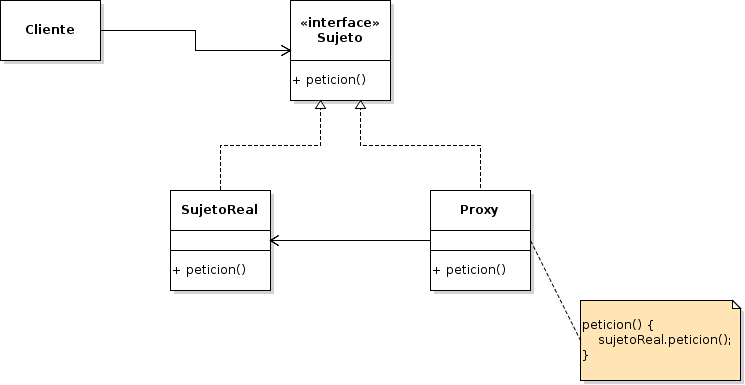

# Proxy

## Propósito

Proporciona un representante o sustituto de otra variable para controlar el acceso a ésta.

## También conocido como

_Surrogate_ \(Sustituto\)

## Estructura



## Participantes

* **Proxy:**
  * mantiene una referencia que permite al proxy acceder a la variable original. El proxy puede referirse a un Sujeto en caso de que las interfaces de SujetoReal y Sujeto sean la misma.
  * proporciona una interfaz ientica a la de Sujeto, de manera que un proxy pueda ser sustituido por el sujeto real.
  * controla el acceso al sujeto real, y puede ser responsable de su creación y borrado.
  * otras responsabilidades dependen del tipo de proxy:
    * los proxies remotos son responsables de codificar una petición y sus argumentos para enviar la petición codificada al sujeto real que se encuentra en un espacio de direcciones diferente.
    * los proxies virtuales pueden guardar información adicional sobre el sujeto real, por lo que pueden retardar el acceso al mismo.
    * los proxies de protección comprueban que el llamador tenga los permisos de acceso necesarios para realizar una petición.
* **Sujeto:**
  * define una interfaz común para el SujetoReal y el Proxy, de modo que pueda usarse un Proxy en cualquier sitio en el que se espere un SujetoReal.
* **SujetoReal:**
  * define la variable real representada.

## Implementación

No se observan impedimentos y/o modificaciones de la estructura original del patrón para su implementación en _Go_.

## Código de ejemplo

En este ejemplo queremos restringir los accesos a redes sociales en los navegadores de una escuela. Para esto realizaremos un proxy de protección.

Implementación:

```go
// Sujeto Interface
type NavegadorInterface interface {
    Direccion(string) string
}

// Sujeto Real
type Navegador struct{}

func (n *Navegador) Direccion(url string) string {
    return "Respuesta de la url " + url
}

// Proxy
type NavegadorProxy struct {
    navegador NavegadorInterface
}

func (n *NavegadorProxy) Direccion(url string) string {
    if url == "http://twitter.com" || url == "http://facebook.com" {
        return "Acceso restringido a " + url
    }

    return n.navegador.Direccion(url)
}
```

Se puede probar la implementación del patrón de la siguiente forma:

```go
navegadorProxy := &NavegadorProxy{&Navegador{}}

fmt.Printf("%s\n", navegadorProxy.Direccion("http://google.com"))
fmt.Printf("%s\n", navegadorProxy.Direccion("http://twitter.com"))
fmt.Printf("%s\n", navegadorProxy.Direccion("http://facebook.com"))
```

[Código de ejemplo](https://github.com/danielspk/designpatternsingo/tree/master/patrones/estructurales/proxy) \| [Ejecutar código](https://play.golang.org/p/7JSOE4GYByc)

